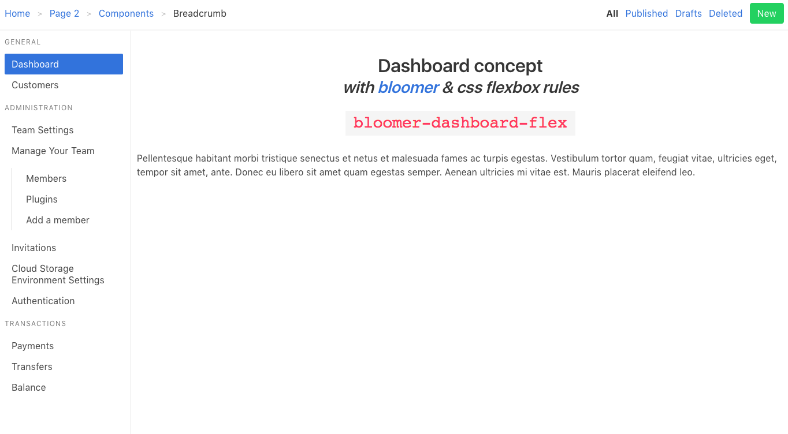

# Dashboard prototype w/ bloomer & css flexbox rules



[Demo](https://bloomer-dashboard-flex.netlify.com/)

## CSS flexbox rules (`sass` format)
```sass
.dashboard-flex
  display: flex
  flex-flow: row wrap
  height: 100vh

  > *
    box-sizing: border-box
    flex: 1 100%

  > header
    order: 1
    height: 6vh

  > aside
    order: 2
    min-height: 89vh
    flex: none
    // same kind as the header
    box-shadow: 1px -2px 0px 1px whitesmoke

  > aside.is-opened
    @media all and (min-width: 600px)
      width: 16.6666667%

  > main
    order: 3
    min-height: 94vh
    flex: 3 0

  > footer
    order: 4
    box-shadow: 1px -1px 0px 1px whitesmoke

```
